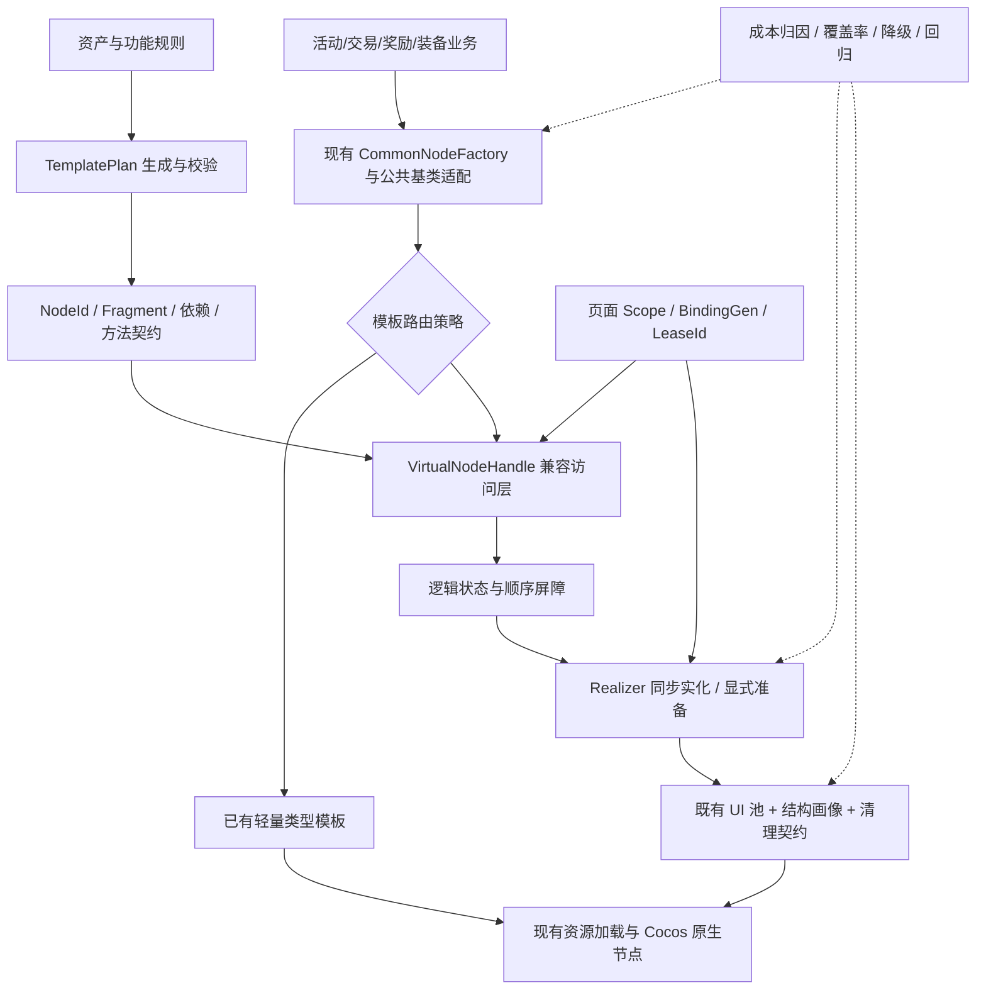

# SLG 复杂 UI 按需实例化与低侵入性能治理架构

**项目背景：**《指环王：纷争》客户端现有虚拟节点方案。  
**设计日期：**2026-10-09。  
**设计目标：**按需、可控、低侵入、精准，服务真实业务与资深游戏客户端技术面试。  
**文档状态：**基于当前源码核查形成的升级设计，不代表升级功能已经实现或已经取得线上收益。

## 1. 项目定位与结论

建议把这个项目定位为：

> 面向 SLG 活动奖励、交易与装备等复杂通用组件，建设兼容旧业务的按需实例化机制；通过模板结构治理、访问语义约束、复用安全和成本归因，降低无效节点的创建及驻留成本，并建立可验证、可回退的接入流程。

不是重写整个 UI 系统，也不是把 Fiber、Lane、Diff、对象池全部堆进去。核心问题是：**一个通用组件能表达很多业务，但一个具体实例通常只使用部分结构，客户端仍可能为其余结构支付创建与维护成本。**

整体采用“**轻量类型模板优先 + 复杂长尾分支虚拟化 + 热点按证据治理**”的混合架构。列表可见区复用是独立基础优化，不能记作新虚拟节点机制的独有收益。

资深级技术深度集中在四个位置：

1. 能识别真正值得优化的成本，并和项目已有合理方案比较。
2. 能保持访问、状态、动画、原生接口和复用之间的语义一致性。
3. 能解释每一份收益的来源，也能承认不适用场景和额外开销。
4. 能把单页技巧变成有工具、有契约、有验收、有回退的生产能力。

### 1.1 不能预先承诺的事情

- 尚无原项目运行时剖析，不能宣称其界面存在多少毫秒卡顿或多少 MB 浪费。
- 原始 CSB/CSD 资产、可运行客户端及目标机尚未齐备，当前可确认的是代码路径，不是原项目性能结论。
- 按需克隆不等于按需加载全部贴图；完整原型保留时仍可能持有资源依赖。
- 2 ms 分帧预算不是不可中断原生调用的硬上限。
- “零侵入”不能扩展成对任意原生对象、任意组件引用、任意副作用都完全透明。
- 一套设计不能保证某家公司的录用结果，也不能凭术语数量获得“10 分”。

## 2. 现状核查：升级从哪里开始

本节的行号对应当前工作区快照。文件检索与静态分析可复核；风险描述不等于已确认线上故障。

| 代码证据 | 当前行为 | 对升级的启发 |
| --- | --- | --- |
| `ui/csd_node/virtual_node.py`：`LazyNodeBuilder`、`LazyNode` | 把模板拆成真实骨架和懒子树；需要时克隆子树并回放操作 | 保留原方案的主体价值，不改造成一个完全不同的通用渲染框架 |
| 同文件：`spawnLast`，约 71 行 | 首次返回虚拟包装并保留其真实根；后续克隆该根当前的展开结构；返回类型不一致 | 结构相同时有优化潜力，但需要隔离结构与业务状态，审计混合类型复用 |
| 同文件：约 127 行 | 用 `get` / `is` 前缀区分方法语义 | 方法名前缀不能证明纯读；需要明确支持表与原生边界 |
| `common_node_base.py`：24、62 行 | 同时支持 `cc.Node` 与虚拟包装；专门通过 LazyUtil 隐藏子节点 | 项目已有低侵入接入点，但并非无需兼容改造 |
| `activity_cn_open_ui.py`：110、150、158 行 | 二层原型，先生成奖励骨架，再通过 CommonNodeFactory 绑定 | 真实试点之一，可以分离骨架克隆与业务绑定成本 |
| `activity_new_player_1.py`：393 行；`activity_new_player_3.py`：568 行 | 新手奖励页使用 `spawnLast`；后者还克隆第一个奖励节点 | 优先测试混合奖励、类型切换和结构状态残留 |
| `mathom/mathom_trade_main_ui.py`：1256、1259、1274 行附近 | 交易页使用三级原型、`spawnLast`，并调用原生 UI 工具与事件绑定 | 适合验证原生逃逸、数量变更、点击目标和复用清理 |
| `equipment_node.py`：81 行 | `setMastery` 先访问精通面板，再判断新版本战斗下是否隐藏 | 路径访问可能先展开最终不用的分支，需通过创建归因证实成本 |
| `equipment_node.py`：63 行附近；`hero_node.py` | 动态 ProgressTimer、套装子节点、英雄头像处理等结构不同 | 不能把所有奖励当作同一种简单角标；动态结构与副作用需要明确边界 |
| `common_node_base.py`：52 行；`utils/cc_util.py`：728 行 | 公共初始化会创建时间线、运行 Action 并跳到动画末帧 | 动画初始化是兼容审计的必查路径，不能仅解决可见状态 setter |
| `common_node_factory_new.py`：55、80 行 | 已有按类型迭代的精简版工厂，不支持的类型回退旧版 | 必须成为竞争基线；不能重复造轮子或只比较最差实现 |
| `res_node_new.py`：13 行；`equipment_node_new.py`：9 行 | 两种类型都使用 `formal_common_item_node_common.csb` | 类型工厂不等于每种类型都有独立资产，要按实际共享结构测量 |
| `core_framework/ui/ui_pool.py`：44 行；`ui/ui_widget_pool.py`：360 行 | 已有加载、原型缓存、克隆和实例复用 | 集成现有资源与池，不另建平行资源管理体系 |
| `ui/ui_widget_pool.py`：380 行 | 当前该归还路径恢复 scale，可选重置动画；未展示完整业务状态清理 | 升级需增加明确的复用契约，不能仅凭“已有池”推断复用安全 |
| `utils/leak_util.py` | 已有 retain/release 记录和节点统计 | 复用诊断接口，补充生命周期归因 |

原方案真正的优势是：**通用模板只克隆必要结构，旧业务仍大体沿用路径与方法访问习惯。** 升级应首先扩大这一优势的可用范围和安全边界，而不是先做通用 Fiber 系统。

### 2.1 已有 Unity 原型给出的反例

已有 HighPerfUI 原型的 1000 装备测试，来自 2026-10-08 Windows Mono 开发构建，三种模式各 10 次独立进程。这里仅用作架构反思，不能代替原项目数据。

| 指标：跨轮中位数 | 常规池化网格 B | 完整框架 C | 解读 |
| --- | ---: | ---: | --- |
| 首屏可交互 | 124.11 ms | 187.16 ms | C 约慢 50.8% |
| 集合 Transform 数 | 964 | 706 | C 约少 26.8% |
| 累计 GC 分配 | 34,294,082 bytes | 35,900,158.5 bytes | C 约多 4.7% |
| Frame P95 | 8.339 ms | 8.337 ms | 接近 120 FPS 上限，不能证明纯 CPU 优势 |

因此，新设计的出发点不是“功能更多，性能必然更好”，而是：**找足够昂贵、足够少用的结构，让节省超过代理、缓存、调度和一致性维护成本。** 简单角标组件不应强制走重框架。

完整测量边界见 [已有实测报告](D:/SLG/HighPerfUI/docs/BenchmarkReport.md)。报告还记录了超过 2 ms 的单步耗时，没有原生调用可中断的保证。

## 3. 业务问题拆解

### 3.1 四类业务成本，而不是一个“节点多”问题

| 问题 | 业务表现 | 候选手段 | 不应混淆的边界 |
| --- | --- | --- | --- |
| 同时创建太多实例 | 大列表首次打开、滚动新增项集中创建 | 可见区复用、现有实例池 | 先做常规优化，虚拟子树不能代替列表治理 |
| 单个实例包含太多无用结构 | 普通资源也复制英雄、精通、时间、特效等长尾结构 | 类型轻量模板、按需子树 | 本方案核心收益位置 |
| 无意义的重复更新 | 数量变化却重做图标、布局或整项初始化 | 字段化状态写入、限定范围刷新 | 不要求把全 UI 改成 MVVM 或完整树 Diff |
| 优化后行为不稳定 | 类型串台、旧回调写新项、动画找不到节点 | 访问契约、结构缓存、版本屏障、原生安全岛 | 这是生产化成本，不能从性能账本里删除 |

### 3.2 首批试点

**试点一：开服活动奖励区域。** 以现有 `spawn()` 接入为起点，分别记录原型准备、每项骨架克隆、类型绑定、子树实化与首屏稳定。确认真实配置中的项数和类型比例，不能凭空给这个页面设置 1000 个奖励。

**试点二：新手奖励混合单元。** 验证资源、道具、装备等交替出现时，`spawnLast` 展开的结构是否适合下一项；重点比较类型工厂和结构画像缓存。

**试点三：交易页数量与选择变化。** 验证数量变化是否只更新目标字段；灰态、选择态、点击事件是否对应当前商品；关闭和重开是否保留旧对象或旧回调。

**可扩展但不预先宣称已接入：**招募结果、活动商店、邮件附件、排行成员等重复复杂单元。每个模块仍需成本审计，不能仅因属于 SLG 就自动纳入。

### 3.3 用户体验底线

- 首屏“可交互”必须意味着首屏应显示的内容已经就绪、点击可命中正确对象。
- 不能用空卡片先出现、内容数帧后补齐的方法美化首屏指标。
- 不改变奖励含义、数量、排序、灰态、特效触发与详情打开目标。
- 新增渐进显示只有在业务认可其体验合同后才能作为独立方案比较，不能偷换对照组。

## 4. 把四个目标写成可测试的契约

| 目标 | 本设计的具体含义 | 验证方式 |
| --- | --- | --- |
| 按需 | 未被业务要求且不属于必要依赖的分支不生成真实实例 | 路径级创建轨迹；同样业务结果下检查未用分支数 |
| 可控 | 可同步取得真实节点；可显式预热；可取消准备；可回收；可降级 | 各操作的状态机和异常测试；公开超支与降级原因 |
| 低侵入，目标接近零业务侵入 | 支持范围内的页面展示逻辑无需改写；改造集中在工厂、基类、公共工具与资产规则 | 逐页列出改动文件、调用点和无法兼容的 API |
| 精准 | 以模板、节点、字段与绑定世代定位更新；不把整树重做当默认策略 | 单字段变更轨迹、版本校验、重绑定测试 |

### 4.1 “零侵入”的严格边界

原项目使用动态语言包装，适合保持 `node["path"].setVisible(...)` 一类习惯。但包装不等于 `cc.Node` 原生指针，任意引擎调用仍可能要求真实节点。

本设计承诺：**在已登记支持的访问契约内尽量做到页面零业务改动；不支持的地方明确实化或回退，并统计覆盖率。** 不承诺消除所有公共基础层改动。

Unity 的 `GameObject`、`Image`、`Text`、序列化组件引用不应假定可以被一个逻辑对象透明替代。Unity 接入应通过公共工厂与生成绑定表实现；已有强类型引用不允许直接伪装。原项目和 Unity 共用设计原则，不共用同一套代理实现。

## 5. 成本模型：如何判断这件事值得做

对一个包含 m 个活动实例的界面，分解：

```text
T_ui = T_template_load + T_clone + T_business_bind
     + T_asset_resolve + T_layout + T_render + T_runtime_overhead

T_new_clone ≈ m × (C_skeleton + C_required_fragments)
           + C_prepare_profiles + C_proxy_and_binding

净收益 = 避免的实例创建/更新成本 - 新增代理/清理/缓存/调度成本
```

不能只看节点数量。一个原生进度条或复杂特效节点的成本可能大于若干普通容器；同样数量的节点在不同平台上也可能不同。

实例驻留量分解为：

```text
M_owned = M_live_instances + M_idle_pool
        + M_templates_and_profiles + M_logical_state + M_owned_resource_refs
```

如果把省下的节点全部留在无上限池中，或者为每种组合缓存一份结构，峰值驻留可能反而上涨。完整贴图、图集、共享材质占用要单独测量；不能把节点实例减少的比例直接写成“总内存减少比例”。

### 5.1 优先级评分，不依赖主观觉得复杂

```text
候选价值 = 真实出现频率 × 每次可避免成本 × 未使用比例
         - 接入维护成本 - 正确性风险成本
```

采集真实类型分布、分支命中率、克隆耗时与重开频率后排序。高频且基本都需要的结构保持真实；很少使用但昂贵的结构优先虚拟化。统计采样覆盖哪些活动版本和设备必须注明，不能把样本中未出现当作永远不会出现。

### 5.2 推广门槛：建议值，不是实测成绩

先取得最佳合理基线，再在实验开始前冻结每页、每设备的主要指标、容差与样本量。以下是建议的强收益门槛，不是现阶段已经完成的 SLA：

- 核心收益至少满足一项：克隆与绑定合计主线程 CPU 降低 30%，或可归因的 UI 实例峰值占用降低 40%。
- 业务结果、命中目标、动画约定与首屏视觉一致性全部通过。
- 首屏和输入到反馈的 P95 不劣化超过 5%；同时检查 P99 和原始长帧，不只检查平均值。
- 不出现不可解释的累计分配上涨或长期关闭重开驻留增长；新增开销必须有成本归因。
- 收益小于噪声、首屏持续恶化、兼容面过小或轻量模板更优时，不推广虚拟化。

30% 和 40% 是高价值项目的候选准入值，可在预实验后、正式比较前修订并记录理由，不能在看到候选结果后降低门槛以宣布成功。若没有可靠的原生实例内存计量，节点数只能作代理指标，不替代内存验收。

## 6. 技术选型：为什么采用混合路线

| 路线 | 优势 | 代价/风险 | 选择 |
| --- | --- | --- | --- |
| 完整通用模板 + 现有池 | 最少兼容风险，资产维护简单 | 第一次克隆与池驻留仍包含无用结构 | 保留为回退与基线 |
| 已有类型轻量 CSB 工厂 | 常见类型可直接降低结构复杂度，运行时机制简单 | 需要维护模板；并非所有类型/功能已覆盖 | 常见稳定类型优先采用 |
| 现有虚拟节点 | 兼容旧通用结构，长尾分支延迟创建 | 路径访问可能实化，操作队列/原生边界复杂 | 保留并修正可控性与安全性 |
| 全面 Fiber + 全树 Diff + 通用三阶段 Commit | 适用于自建完整声明式 UI 运行时 | 重写面大；旧命令式业务收益不明确；制造新的迁移问题 | 不作为本项目默认路线 |
| 类型模板 + 受约束的虚拟分支 + 画像复用 | 常见路径轻，复杂结构仍兼容；可按页面选择 | 需要资产契约、方法语义表与复用验证 | 推荐路线 |

### 6.1 具体选择

1. **按用途选择结构，不强制统一一个巨大 prefab/CSB。** 常见资源、普通道具直接使用经验证的轻量模板；复杂装备、英雄、长尾功能保留可选片段。
2. **构建期生成结构元数据，运行时保留兜底。** 已知资产路径解析成 NodeId，避免热路径反复拆字符串；找不到资产工具链时只做调试期扫描，不伪称已经完成离线编译。
3. **逻辑状态优先，副作用按顺序。** 只有明确的纯状态写入可合并；动画、原生引用、回调和结构操作不做任意压缩。
4. **优先简单显式任务步骤，不强制 Fiber。** 仅对可拆的预热或非首屏片段进行分帧；同步旧接口仍履约，记录其成本。
5. **复用既有池与资源加载。** 增加结构 key、清理契约和预算，不再创建第二套独立资产系统。

## 7. 总体架构



### 7.1 模块职责与所有权

| 模块 | 做什么 | 不做什么 |
| --- | --- | --- |
| 工厂适配与 Router | 根据业务类型、页面策略和资产版本选择完整/轻量/虚拟路线 | 不重写业务奖励含义、数据协议或页面管理 |
| TemplatePlan | 记录稳定 NodeId、默认值、片段边界、强制真实岛、依赖与结构版本 | 不依赖不可解释的运行时猜测决定关键布局 |
| VirtualNodeHandle | 在明确支持的路径/方法范围内保留业务访问习惯 | 不冒充原生指针，不静默吞掉未知方法 |
| StateStore | 保存未实化节点的最终字段状态和有序屏障 | 不无限缓存命令，不推迟需要立即观察的副作用 |
| Realizer | 生成、初始化、验证、发布真实片段；支持显式准备与取消 | 不承诺打断单次原生 clone 或资源解析 |
| 池扩展与 ShapeCache | 按结构复用，重置状态，限制闲置驻留 | 不以某个活跃业务实例作为可信新模板 |
| Scope/Binding 生命周期 | 管理有效性、事件/任务/资源所有权与版本 | 不修改全项目网络层和其他模块生命周期 |
| Audit/Replay 验证工具 | 解释创建原因和成本，复现业务轨迹，检查收益与语义 | 不把调试全堆栈采集放进正式热路径 |

### 7.2 建议的数据模型

```text
TemplatePlan:
  TemplateId, TemplateEpoch, SchemaVersion
  PathToNodeId, Fragments, DependencyGroups, EagerIslands
  DefaultState, SupportedMethods, ResetContractVersion

ViewBinding:
  LogicalItemId, BindingGen, ScopeEpoch

NodeHandle:
  NodeId, FragmentId, DesiredState, CommittedRevision
  RealNode?, LeaseId?, LifecycleState

ShapeKey:
  TemplateId, TemplateEpoch, ProfileId, ResetContractVersion
```

`BindingGen` 标识“这个承载对象现在绑定哪一次业务数据”；`LeaseId` 标识“这一次从池拿出的真实对象”。同一商品多次绑定、同一对象绑定不同商品都必须区分。

不把商品 ID、数量、昵称或贴图路径塞进 ShapeKey。它们是数据，不是结构。画像只包含决定结构的少量已知特征，并设置上限；超出组合直接使用标准虚拟方案或完整模板，不无限生成新画像。

## 8. 运行时语义：这是技术深度的核心

### 8.1 状态不是节点，句柄不是原生节点

逻辑句柄可以存在，而真实子树尚不存在。状态写入先进入逻辑态，实化时再应用。根骨架仍提供原项目需要的挂载点，不试图让整个父节点也凭空消失。

保留原 `LazyUtil.getRealNode` 的兼容语义：它只查看已存在的真实节点，不应悄悄变成强制创建。新增强制接口必须独立命名。

```text
PeekReal(handle)                 -> 只查看，不创建
RequireReal(handle, reason)      -> 同步履约；必要依赖就绪后返回
Prepare(handle, policy, token)   -> 显式异步准备；未 Ready 不声称可操作
Release(scope or lease)          -> 失效并清理所有权
```

这些是设计接口，不是当前原代码已经具有的 API。

### 8.2 路径访问与原生操作分开

支持范围内，`node["path"]` 可以返回逻辑句柄，不因此自动克隆整个分支。随后调用已登记纯状态 setter 时保持虚拟；需要原生对象的操作才经过 RequireReal。

但路径访问还包含“节点不存在返回什么”、布尔判断、身份比较、`getChildren` 返回类型等历史语义。升级必须先扫描调用点，明确兼容合同。**无法证明兼容的路径继续旧行为，而不是全局替换 `__getitem__`。**

默认采用按模板、按页面启用，不修改全引擎 `cc.Node` 的通用行为。

### 8.3 方法语义表，替换名字猜测

| 类别 | 例子 | 未实化时的行为 |
| --- | --- | --- |
| 可证明的逻辑纯读 | 名称、已存储的可见状态；登记过的默认字段 | 从逻辑态读取，支持读写一致性 |
| 纯状态写入 | `setVisible(False)`、文本、颜色、数量，须逐类登记 | 更新逻辑态；只在无屏障连续区间内合并 |
| 依赖几何/布局的读取 | 世界坐标转换、实际布局尺寸、渲染边界 | 完成必要真实/布局依赖后读取 |
| 可观察的命令/结构副作用 | 播放动画、`addChild`、原生 listener 注册 | 先提交之前状态，再按原序执行，通常要求真实节点 |
| 原生逃逸 | 把节点传入灰态工具、动画绑定、引擎 API | 显式取真实对象，登记逃逸与生命周期限制 |
| 未知方法 | 任何未登记扩展 API | 同步实化或局部完整回退，并记录原因；不静默忽略 |

`setVisible(True)` 对可见分支默认形成就绪要求，避免返回后仍缺失画面。要异步展示必须走另一个显式业务合同。

对于已实化且已向外暴露的节点，默认同步写入；不能让业务刚调用 setter、随后直接读原生节点时看见旧值。

### 8.4 合并操作的边界

```text
setText("10") -> setText("11") -> setText("12")
在同一连续纯状态区间内可以压缩为最终值。

setVisible(True) -> playAction() -> setVisible(False)
不能压缩为最后一个 False：中间动画与观察语义必须保留。

setPosition(10, 20) -> setPositionX(30)
不能按方法名分别粗暴去重；需要登记复合字段语义，结果应是 (30, 20)。
```

相对操作、读操作、命令、副作用和原生逃逸都可能形成屏障。首版不支持可靠合并的操作，选择同步真实执行；不为了增加支持数量牺牲正确性。

未实化分支的状态由“默认值 + 变更”恢复，不能直接从模板读一个已经被其他业务修改过的值。最终值表规模受资产字段集合约束，不建立无上限 func_queue。

## 9. 结构治理：升级 `spawnLast`，隔离结构与业务实例

### 9.1 原方法的价值和风险

`spawnLast` 适合多个实例最终结构相同的路径：第一项的真实根被保留，第一项完成展开后，后续复制这个根当前的展开结构，可以少做代理和重复子树展开。它不是每次自动更新为“最近创建的项”；只有显式释放后才重新选择首次根。

但被保留的第一项同时是业务实例，可能包含数量、业务属性、事件闭包、动态子节点和已经展开的特效。哪些状态会被原生 `clone()` 复制、哪些引用仍指向原对象，需要按匹配引擎验证，不能假定 clone 会复制所有 Python 属性或 listener。混合奖励场景不能仅凭“都是通用物品”认定结构完全相同。这里是待验证风险，不直接断言原方法线上错误。

### 9.2 替代机制：Canonical Profile

结构画像来源于 TemplatePlan 与功能合同，不来自任意活跃业务实例：

```text
资源基础画像：图标 + 底板 + 数量
装备基础画像：资源基础结构 + 装备标识
装备精通画像：装备基础结构 + 精通安全岛
英雄画像：英雄显示相关依赖组
```

以上是候选划分，必须结合真实 CSB 与调用依赖确认，不能仅据名称自动切开。

画像缓存保存**无业务绑定的干净结构**；生产实例另行绑定。池按 ShapeKey 管理。模板或清理版本变化时旧缓存不再参与分配，在引用释放后回收。

### 9.3 兼容迁移

- 保留旧 builder 对外入口，工厂内部先可选切换画像模式。
- 审计依赖 `spawnLast` 返回类型、原生 `clone()`、动态属性的调用点。
- 不兼容调用点继续旧路线；迁移完成前不把所有返回值统一成句柄而破坏原生调用。
- 对结构不确定的实例，退回标准懒子树或完整模板；不能使用未经验证的其他业务实例画像。
- 缓存容量受预算约束；重开很少且命中率低时直接不缓存画像实例。

## 10. 生命周期、一致性与池安全

### 10.1 生命周期状态机

```text
Virtual -> Preparing -> Real
Virtual -> Real                  同步 RequireReal
Preparing -> Virtual             可恢复的取消；逻辑句柄仍有效
Virtual/Preparing/Real -> Retiring -> Recycled
Preparing -> Failed              清理部分所有权，再局部降级或明确失败
```

页面关闭或重新绑定的第一步是使旧 BindingGen / ScopeEpoch 失效，不是等所有任务“做完再关闭”。Retiring 状态不再接受写入，不允许完成回调复活页面。

### 10.2 多重校验，而不是只看对象还在不在

```text
请求发起时记录：ScopeEpoch + BindingGen + TemplateEpoch + LeaseId
回调完成时核验当前所有者和版本。

有效：写入当前目标，并推进 CommittedRevision。
失效：不写入；归还本请求取得的资源/临时对象；不占有新绑定资源。
```

还需防止同一绑定内“后发请求先完成、先发请求后覆盖”的乱序问题：每个异步字段记录请求 Revision，只提交该字段当前接受的版本。绑定世代和字段版本解决的是不同问题。

ResourceTicket 仅封装本模块通过既有加载器取得的所有权；不引入另一套全局资源引用计数。取消不必强行中断底层加载，但其完成必须走失效清理。

### 10.3 池归还合同

归还前执行顺序：

1. 失效旧绑定与任务；解除本次租约注册的 listener、订阅和计时器。
2. 停止属于本实例的动画/Action；不能误停共享资源或其他模块任务。
3. 清理业务动态属性、选中/灰态、数量、贴图引用及本次添加的动态子节点。
4. 恢复结构画像默认值，校验节点、依赖组和 ResetContractVersion。
5. 从活动父节点脱离；确认 retain/release 所有权，再进入既有池。

无法验证清理的实例不得入池，选择销毁或旧安全路线。未知事件注册若无法通过公共工具登记所有权，对应模板禁用复用，避免“归还了但回调还在”。

在现有 `UIWidgetPool.freeWidget` 上增加可选 reset 扩展与独立测试，不改变其他未接入页面的行为。模板原型、池实例、父节点与任务引用各自计账，复用 LeakUtil，不能随意多加一次 retain。

### 10.4 原生引用逃逸的真实限制

外部业务长期保存裸 `cc.Node` 后，框架不能自动拦截它的每次写入。首版规定：逃逸对象不得在外部引用仍有效时换绑复用；必要时把该区域标为 EagerIsland 并关闭复用。对要求长期原生引用的模块不强推逻辑句柄。

## 11. 分帧、依赖与首屏：只解决需要解决的峰值

### 11.1 首先缩小工作，再分帧

节省不需要的结构属于减少总工作；分帧主要改变工作分布，可能延长打开时间。优先顺序是：轻量模板、避免误实化、结构复用、降低无效更新，最后才对可拆工作分帧。

### 11.2 两条执行路径

**同步路径：**旧业务需要真实节点时同步 RequireReal，保证调用返回后的既有语义。昂贵调用记录为超预算原因，后续通过更小资产片段或提前 Prepare 优化。

**显式准备路径：**只对页面提前预热、非首屏内容或明确接受异步合同的功能，执行 `Acquire -> Create -> Bind -> Validate -> Publish` 任务步骤。各阶段检验绑定世代，取消时清理已经取得的资源。

这不是宣称实现完整 React 三阶段 Commit。关键是局部片段的发布门槛：初始状态、父子依赖、必要布局与事件目标一致之后，才允许呈现为 Ready。

### 11.3 依赖安全岛

- 首版将跨分支动画、动态进度控件、原生 shader/工具依赖定义为完整真实岛。
- 对资产中能够静态识别的引用形成 DependencyGroup，共同准备与验证。
- 找不到完整引用信息的区域采用保守真实化，不以“自动分析应该能识别”为依据。
- 精通面板是否可分割，需包含其 ProgressTimer 创建与后续原生访问合同，不能只切出一个容器。

TemplatePlan 校验时把片段引用表示为依赖图：计算必要闭包，按依赖顺序准备；静态循环依赖合成同一个原子组。若无法形成合法树结构或无法完整确认引用，则把相关区域标为真实岛。NodeId 缺失、模板版本不匹配或边界引用未解析时不发布部分结构，而是回退。不能让业务在发布后才发现节点少了一半。

公共 `goToEndFrame` 也纳入 API 审计：优先在模板准备期固定可证明的静态初始状态；涉及业务副作用或不能静态固化的时间线仍走真实安全岛。没有取得动画资产和引擎验证前，不宣称已消除时间线初始化成本。

### 11.4 调度政策

仅为必要的异步准备提供小型队列：前台即将使用的片段优先，后台预热其次，闲置清理最后。采用轮转或老化避免长期饥饿；新高优任务只能在步骤边界抢先，不能打断原生 clone。

首版预算固定、可配置并记录超支，不做没有证据的自适应控制器。若单步频繁超支，应继续拆资产或减少同步工作，不能仅把预算数字调大。

## 12. 关键难点、解决方式与代价

| 难点 | 具体策略 | 为什么这样选 | 剩余代价/限制 |
| --- | --- | --- | --- |
| 隐藏分支因路径访问提前创建 | 受约束的路径句柄 + 已登记状态操作；不兼容路径保持旧行为 | 保留业务习惯，并精确识别创建原因 | 需要兼容性扫描；不是任意对象透明代理 |
| 动态方法语义难以推断 | 显式方法注册，未知方法实化或回退 | 正确性比支持数量重要 | 新 API 需登记，覆盖率是治理指标 |
| 混合奖励结构不同 | 干净结构画像 + 有界 ShapeKey 缓存 | 保留 `spawnLast` 的少重复工作价值，避免活跃实例污染 | 画像准备有成本，低频类型不宜缓存 |
| Setter 合并破坏命令顺序 | 连续纯状态区间合并，读/命令/逃逸作为屏障 | 在不改变业务可观察行为前提下降低重复写入 | 不能把所有操作压成一个最终快照 |
| 页面关闭/重绑定竞态 | ScopeEpoch、BindingGen、LeaseId、字段 Revision | 区分页面有效性、业务身份、池租约与请求顺序 | 每个完成路径必须覆盖清理 |
| 动画与布局引用断裂 | 依赖组、保守 EagerIsland、发布校验 | 分支优化不能牺牲动画与点击正确性 | 部分复杂结构无法虚拟化 |
| 池命中高但驻留也高 | 现有池增加按结构预算、闲置回收、清理失败退出 | 同时约束热打开与峰值占用 | 清理/回收有开销，需要设备验证 |
| 旧业务持有原生引用 | 逃逸跟踪，禁止不安全复用，局部回退 | 不许诺框架无法拦截的行为 | 覆盖范围可能小于全 UI |
| 资源内存收益不明显 | 分开记节点与资源；仅有物理依赖拆分才评估加载收益 | 防止用节点数冒充贴图节省 | 资产拆分属于后续可选工作 |
| 指标好但体验变差 | 首屏视觉/点击合同、独立冷/热与尾延迟测试 | 防止把等待或空白排除出指标 | 验证成本高于简单 Stopwatch |

## 13. 可观测性：必须解释为什么创建

每一次实化记录有限集合的 ReasonCode：

```text
VISIBLE_REQUEST       业务要求可见
EXPLICIT_REQUIRE      显式原生访问
LEGACY_PATH_ACCESS    保留旧语义导致创建
LAYOUT_DEPENDENCY     必要布局依赖
ANIMATION_ISLAND      动画/原生安全岛
PROFILE_PREWARM       画像预热
UNKNOWN_METHOD        未登记 API
COMPAT_FALLBACK       局部兼容降级
```

聚合维度为 PageId、TemplateEpoch、ProfileId、FragmentId、ReasonCode。记录创建 CPU、节点数、首次/复用、分配、撤销与清理结果。不能为每个热路径请求都分配长字符串并采集堆栈；详细调用栈仅在采样调试模式启用。

重点报表：

- 一个页面哪些分支创建最多，哪些最终没有显示。
- 同一字段重复写入和成功合并数量，未知方法比例。
- 缓存命中同时对应多少闲置驻留、多少清理 CPU。
- 同步实化导致的长帧与触发接口，不把它藏在 scheduler 指标外。
- 关闭后未释放所有权、失效回调丢弃数、清理失败数。

诊断应能从“某页面首屏变慢”追溯到“某画像准备成本或某原生 API 强制展开”，而不只有一个总帧率面板。

## 14. 验证协议：公平地证明收益

### 14.1 对照组定义

| 组别 | 配置 | 用途 |
| --- | --- | --- |
| B-full | 当前完整模板 + 现有合理加载与池 | 验证最基础结构成本 |
| B-lazy | 原项目已使用的虚拟节点实现 | 回答升级相对原方案增加了什么 |
| B-typed | 已有轻量类型工厂；未覆盖类型用既有回退 | 防止把资产精简已有收益重复记账 |
| C-hybrid | 本设计的混合路由与兼容治理 | 候选方案 |

实际列表场景，各组使用相同的可见区复用能力、相同物品分布、相同布局和相同资源策略。报告注明每种类型的工厂覆盖情况。以满足功能语义的最佳合理基线判断准入，不只对比 B-full。

### 14.2 轨迹与场景分别测量

1. 冷打开：明确清理了什么缓存，资源是否在内存；不可假装已清掉 OS/GPU 缓存。
2. 热重开：相同页面、相同缓存预算与状态，分别统计复用成本。
3. 混合奖励：资源 -> 装备 -> 英雄 -> 资源，验证结构切换。
4. 高频字段：数量、选择、灰态等单字段更新，不刷新整页作为候选作弊。
5. 首次使用长尾功能：精通、套装、特效等，记录输入到可见反馈。
6. 生命周期压力：打开 -> 关闭 -> 重开，加载/准备中换绑，延迟和乱序完成。
7. 长时间运行：缓存达到预算后反复操作，检查占用是否持续增长。

使用脱敏真实业务调用轨迹，合成压力负载另列。1000 项是容量压力条件，不是所有实际页面都存在 1000 个奖励。

### 14.3 指标与口径

| 层次 | 指标 |
| --- | --- |
| 体验 | 首屏真实可交互、输入到反馈 P50/P95/P99、长帧次数 |
| CPU 归因 | 资产准备、克隆、业务绑定、代理访问、状态提交、布局/渲染分别计时 |
| 对象 | 活动真实节点、模板节点、池闲置节点、逻辑句柄，分别统计 |
| 内存 | 原生实例、脚本/托管堆、资源依赖、全进程驻留，注明工具与精度 |
| 分配 | 累计分配和按阶段分配；GC 次数/停顿须独立采集，不从 bytes 推算 |
| 一致性 | 业务摘要、字段读取、层级/ZOrder、关键帧画面、真实点击目标 |
| 治理 | 覆盖率、未知方法、强制实化原因、降级、清理失败、接入改动量 |

每种配置至少 10 次独立进程只是起步；根据方差和主要指标继续增加。轮换执行顺序，保留失败轮和环境状态。尾分位从每场景独立样本计算，不把打开、稳态、启动混成一个无法归因的数字。

记录构建 hash、资产/规则版本、设备、分辨率、质量设置、帧率上限、温度条件。Unity 用非 Editor 的目标构建和移动真机，原项目用原引擎对应目标构建；两者数据不合并排名。

### 14.4 正确性测试矩阵

- 路径存在/不存在、名称与布尔判断、重复取句柄、模板默认值读取。
- 设置后立即读取、复合属性、相对操作、命令屏障、原生逃逸后的即时可见性。
- 各类型 A -> B -> A 切换，套装/精通/英雄等动态结构残留。
- 当前商品点击、数量更新、灰态选择、关闭后触发旧事件。
- 同绑定内乱序完成、旧绑定完成、旧 Lease 完成、加载失败、部分准备失败。
- 动画前后帧、布局坐标、触摸穿透、实际指针点击，不能只直接调用按钮回调。
- retain/release 平衡、池归还重复调用、清理异常、闲置回收。

可以先用 fake native node 对 Python 2 兼容代理与状态机做单元测试。但 fake 测试不能证明真实引擎类型转换、动画、布局、内存或 GPU 行为。

### 14.5 消融与停止条件

消融比较：关闭状态合并、关闭画像缓存、改回同步准备、改用轻量模板。正确性与生命周期防护始终开启，不把禁用防护后的速度当作可交付结果。

停止/转向条件：

- 大部分可选分支本来就会使用，避免成本低于代理成本。
- B-typed 已达到需求，新方案收益不足以抵偿维护。
- 池导致内存上涨而业务热重开并不频繁。
- 原生逃逸或动画依赖使大部分结构必须保持真实。
- 新方案只有大规模极端负载收益，真实页面无改善。

此时选择资产精简、局部业务修正或既有列表池，不把“必须使用虚拟节点”作为结论。

## 15. 落地分期与完成标准

本节是执行路线，不是完成清单。原游戏引擎、资产与可运行客户端是后续原项目集成的必要输入。

| 阶段 | 交付 | 验收/退出条件 |
| --- | --- | --- |
| P0 成本审计 | 三个真实试点的类型分布、访问/API 清单、创建原因、最佳基线 | 找出值得优化的结构；没有强收益候选就停止扩框架 |
| P1 最小兼容内核 | TemplatePlan 子集、句柄、方法契约、同步 Require/Peek、局部回退、fake 测试 | 已登记路径读写与副作用合同通过；不承诺任意节点透明 |
| P2 结构与复用治理 | 有界画像缓存、ShapeKey、reset 扩展、BindingGen/LeaseId、所有权校验 | 混合奖励和复用压力测试通过，不发生状态串台 |
| P3 一个真实页面闭环 | 工厂可选接入，真实引擎轨迹、视觉/点击/成本对照 | 相对最佳基线满足冻结门槛，否则回退或调整选型 |
| P4 按需扩展 | 在证据支持下增加显式 Prepare、字段 Revision、资源完成清理 | 首次点击、取消和乱序验证通过；没有收益不加调度复杂度 |
| P5 生产治理 | 模板版本校验、接入报告、灰度开关、回归与成本预算 | 可在创建下一页面实例时关闭策略；不需要重写业务 |
| P6 Unity 适配证明 | UGUI 工厂/绑定表适配、同类复杂业务、Package 集成示例 | 独立验证强类型边界与目标平台收益，不冒充原项目线上证明 |

### 15.1 回退策略

策略按页面/模板/版本启用。关闭策略后，新实例走既有完整或轻量路线；已存在虚拟实例按原合同完成或安全销毁，不在交互过程中随意换掉对象身份。

未知方法可以局部同步实化；模板校验失败则整个相关模板回退。回退只能恢复业务正确性，可能影响性能，因此必须记录并报警，不能静默回退后仍宣称虚拟化覆盖率 100%。

### 15.2 生产级完成的定义

只有具备目标平台实测、主要类型契约、真实布局动画点击回归、长期驻留验证、版本校验、灰度和回退记录，才能叫生产级能力。只有可运行 demo 与几十个单元测试，应称工程原型。

## 16. 架构决策记录

| 决策 | 选择与理由 | 重新评估条件 |
| --- | --- | --- |
| ADR-01 优化边界 | 通用复杂单元与工厂接入，不重写整个 UI 应用 | 多模块出现共同且无法局部解决的问题 |
| ADR-02 模板路线 | 常见类型精简，长尾分支虚拟，完整模板回退 | 数据证明单一路线更简单且收益相同 |
| ADR-03 方法兼容 | 显式语义表，未知方法真实化 | API 覆盖稳定且能生成可靠绑定代码 |
| ADR-04 状态提交 | 受屏障约束的字段合并；真实逃逸路径同步 | 业务愿意改成明确异步/声明式合同 |
| ADR-05 结构缓存 | 无绑定的 canonical profile，不复制活跃最后实例 | 性能证据要求额外画像且有清理证明 |
| ADR-06 时间预算 | 同步兼容优先，显式 Prepare 才分帧 | 首屏工作足够可拆且分帧确实改善体验 |
| ADR-07 动画布局 | 保守真实岛，不首版通用重写动画引用 | 已有资产工具能完整提取并验证引用 |
| ADR-08 资源与池 | 扩展既有 UIPool/UIWidgetPool/LeakUtil | 原接口确实无法表达必要所有权或预算 |
| ADR-09 推广 | 相对最佳合理基线达到门槛才接入 | 业务体验或成本目标变更，先重新冻结协议 |

## 17. 如何讲成资深客户端项目

### 17.1 三分钟叙述模板

以下是未来完成相应阶段后的叙述结构；现阶段不能把设计或目标写成自己已完成的线上成绩。

> 项目中的通用奖励单元兼容很多类型，页面实际使用的结构却不同。我先区分列表实例数量问题和单实例结构冗余问题：可见区复用解决前者，类型模板和虚拟子树解决后者。
>
> 原项目已有懒子树和按类型轻量工厂，所以我没有从零重建 UI，而是比较两种路线，选择常见类型精简、长尾结构按需的混合架构。
>
> 真正的难点是保持旧业务语义。路径访问可能触发不必要创建；被缓存业务实例的结构和状态不能直接当干净模板；动画、原生接口、异步回调和对象池都会影响正确性。我用明确的方法合同、干净结构画像、版本化绑定和租约清理来限制这些风险。
>
> 性能上不只比较全量创建，还比较已有虚拟方案和轻量工厂。各阶段分别计时，检查首屏、首次使用长尾功能和长期驻留。如果新增机制没有超过最佳基线，就不推广到该页面。

有实测后，在最后补充真实设备、真实场景、相对最佳基线的收益与代价，不填“92% 命中率”“GC 减少 80%”等未经测量的示例数据。

### 17.2 面试官可能追问什么

| 追问 | 应该回答到的深度 |
| --- | --- |
| 为什么不直接拆 prefab/CSB？ | 项目已有轻量工厂；稳定类型优先拆，长尾兼容成本再用虚拟化；展示最佳基线比较 |
| 为什么不只用循环列表？ | 循环列表限制实例数量，虚拟子树限制单实例的无用结构，收益分开归因 |
| 设置后马上读取怎么办？ | 逻辑状态读写一致；几何读/原生命令形成屏障；逃逸对象默认同步 |
| 为什么不能直接最后写入覆盖？ | 动画、副作用和复合字段有顺序语义，举具体反例 |
| 页关了加载才回来怎么办？ | 检查 ScopeEpoch/BindingGen/LeaseId，失效完成还必须归还资源 |
| 同一个商品先后请求乱序呢？ | 绑定世代不够，还需字段请求 Revision |
| `spawnLast` 为什么要改？ | 展开结构可以复用，但业务状态和未知动态子节点不能作为原型；用干净画像 |
| 2 ms 怎么保证？ | 预算只能控制步骤边界；同步原生超支真实上报，必要时拆资产/预热 |
| 节点少了为何不一定更快？ | 代理/调度/分配/清理可能超过收益；已有 Unity 对照就是反例 |
| 不侵入为什么还要改代码？ | 页面合同内尽量零业务改动，工厂/基类/工具层集中改造；不支持 API 明确回退 |
| 线上出问题怎么办？ | 页面/模板策略开关，新实例回退，旧实例安全退出，记录降级而不是隐藏问题 |
| 是否所有 UI 都适合？ | 小组件、全部结构都用的页面、强原生引用/动画密集区域可能不适合 |

### 17.3 体现的资深能力

- **问题拆解：**把列表数量、结构冗余、更新浪费和正确性分开。
- **架构判断：**尊重已有类型工厂、池、资源工具，限制改动边界。
- **技术深度：**访问语义、顺序屏障、复用所有权、版本化一致性与依赖发布。
- **工程价值：**成本归因、公平对照、真实平台、推广门槛和回退。
- **技术推动：**资产规则、接入报告、API 支持清单与业务协作流程。

这些能力可以作为大厂资深客户端面试的项目材料；不等于“架构复杂就符合腾讯标准”。岗位方向不同，UI/业务架构、性能专项、引擎渲染的考察也不同，本项目应围绕客户端业务工程与性能治理展示。

## 18. 当前已有、明确待补与范围外

| 状态 | 内容 |
| --- | --- |
| 当前源码已有 | 懒子树、原型生成、路径/层级策略、延迟操作、`spawnLast`、公共工厂接入、已有类型精简路线、池和 LeakUtil |
| 当前 Unity 原型已有 | Package 工程预览、复杂装备业务、池化列表与框架对照、测试及 Windows 实测报告 |
| 本次设计，尚未实现 | 方法语义注册、非误实化路径合同、TemplatePlan 校验、干净画像缓存、完整 reset/Lease/字段 Revision、原项目分场景归因与灰度闭环 |
| 原项目验证所需输入 | CSB/CSD 与引用元数据、匹配的引擎/可运行客户端、真实业务配置与目标机、原生成本计量接口 |
| 不作为本期目标 | 全 UI MVVM 重写、通用树 Diff、完整 Fiber、动画系统重写、自动拆分任意 prefab、保证每帧 2 ms、证明所有资源内存都下降 |

**最终建议：**做一套“能判断哪里该用、能保持业务语义、能解释收益、能安全退出”的性能治理能力。先让一个真实页面相对项目最佳现有方案取得足够收益，再扩大接入。这个方向比一个术语齐全但所有页面都强制使用的框架更适合资深客户端项目。

## 附录 A：源码复核入口

当前工作区为 `C:/Users/mawei/OneDrive/Desktop/面试/script`。

- [原虚拟节点实现](<C:/Users/mawei/OneDrive/Desktop/面试/script/ui/csd_node/virtual_node.py>)
- [公共单元基类](<C:/Users/mawei/OneDrive/Desktop/面试/script/ui/csd_node/common_node_base.py:62>)
- [已有精简工厂](<C:/Users/mawei/OneDrive/Desktop/面试/script/ui/csd_node/common_node_factory_new.py:55>)
- [装备精通逻辑](<C:/Users/mawei/OneDrive/Desktop/面试/script/ui/csd_node/equipment_node.py:81>)
- [开服活动试点](<C:/Users/mawei/OneDrive/Desktop/面试/script/activity/activity_panel_ui/activity_cn_open_ui.py:110>)
- [新手奖励试点](<C:/Users/mawei/OneDrive/Desktop/面试/script/activity/activity_panel_ui/activity_new_player_3.py:568>)
- [交易试点](<C:/Users/mawei/OneDrive/Desktop/面试/script/mathom/mathom_trade_main_ui.py:1256>)
- [现有实例池](<C:/Users/mawei/OneDrive/Desktop/面试/script/ui/ui_widget_pool.py:360>)
- [现有加载池](<C:/Users/mawei/OneDrive/Desktop/面试/script/core_framework/ui/ui_pool.py:44>)

这些链接用于当前机器，跨机器阅读以相对源码路径定位；文档没有包含原项目完整源码或私有业务数据。

## 附录 B：Unity 适配参考

UGUI 适配应先独立检查 Canvas 更新、布局、事件与池化，不把所有渲染问题都归到虚拟节点。Unity 官方资料也分别讨论这些基础优化：[Unity UI 性能优化技巧](https://unity.com/cn/how-to/unity-ui-optimization-tips)。本设计引用其作为基础路线参考，不据此推导本项目收益比例。

原项目 Cocos 路径代理与 Unity 强类型绑定边界不同。Unity Package 应保留现有 UGUI 行为、给工厂/公共绑定层提供显式接入，并在目标平台重新验证。Windows 装备 demo 不是原 SLG 项目已经完成改造的证明。
